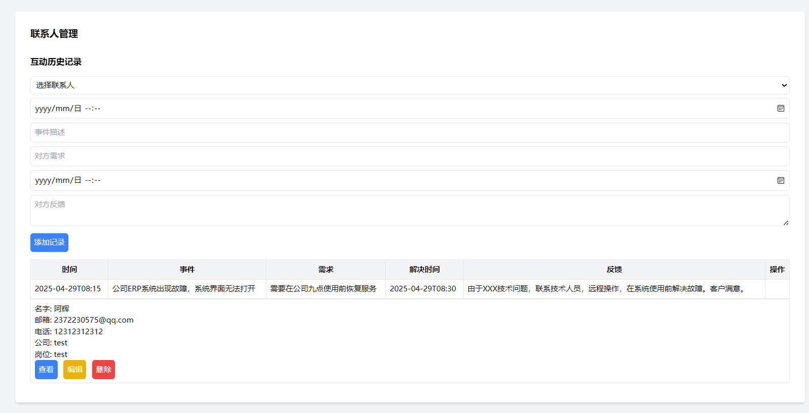
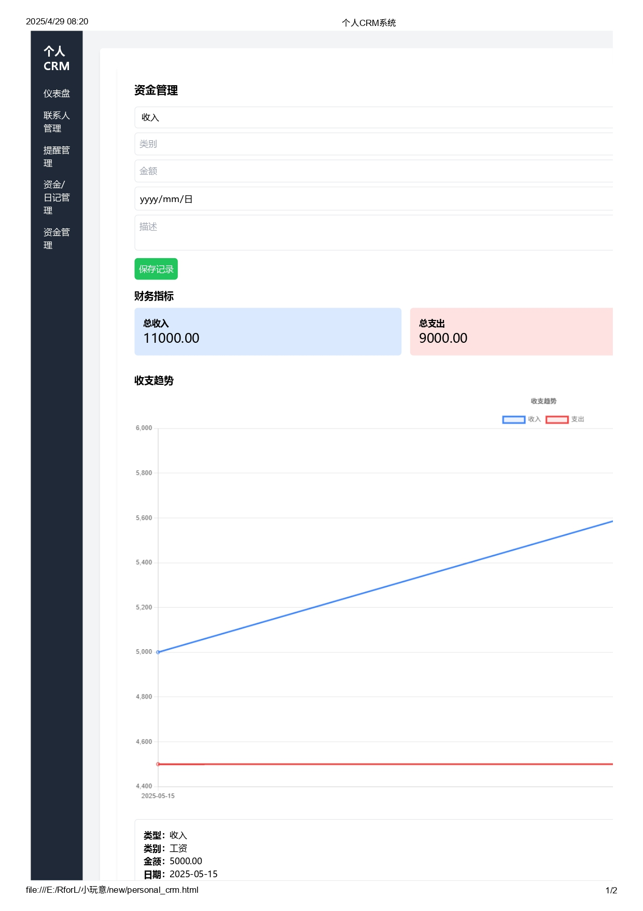
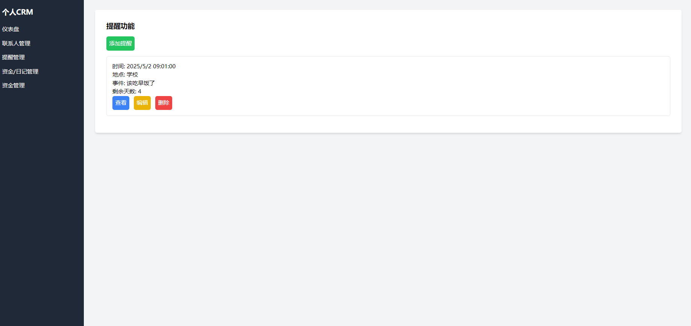

# 个人CRM系统

## 项目概述
这是一个基于浏览器的个人客户关系管理系统，帮助用户管理联系人、提醒事项和财务记录。

## 主要功能
- 联系人管理：记录联系人详细信息、互动历史和备注
- 提醒管理：设置重要事件提醒
- 资金管理：记录收支情况，生成财务图表
- 日记功能：记录日常活动

## 使用说明
1. 直接打开`personal_crm.html`文件即可使用
2. 所有数据存储在浏览器本地存储中

## 截图展示

## 技术栈
- HTML/CSS/JavaScript
- Tailwind CSS
- Chart.js (用于财务图表)

## 未来计划
- 添加数据导出/导入功能
- 增加多设备同步支持